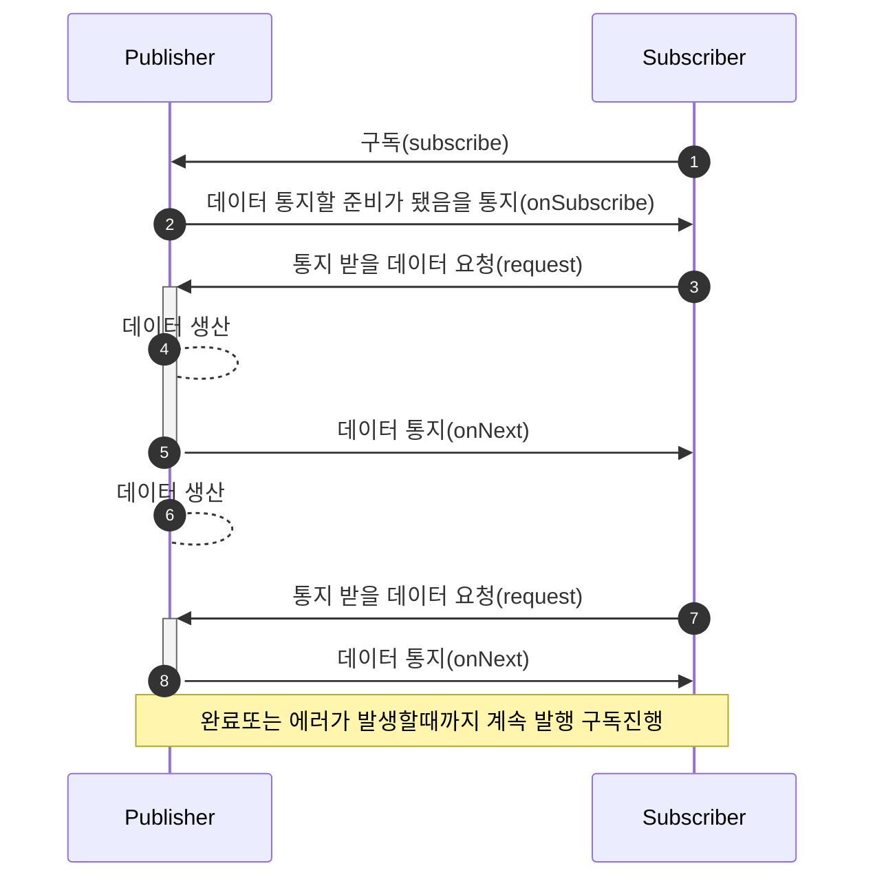

> [!note] RxJava란
> 자바에서 리액티브 프로그래밍을 구현하는데 사용하는 라이브러리이다.
> 2.0부터 Reactive Streams 사양을 구현하며 어떤 데이터 스트림을 비동기로 처리한느 공통 메커니즘을 인터페이스로 제공한다.

## Reactive Programming
> 프로그램이 반응해 데이터를 처리하는 방식이다.

예를들어 `abc` 와 같이 입력을 한다고 생각해보자. 그러면 아래와 같이 입력이 보일 것이다.
- a
- ab
- abc
  문자열을 입력하는 행위는 데이터가 순서대로 생성되고 처리된다.

## Reactive Streams
> 데이터를 만들어서 통지하는 Publisher(생산자)
> 받아 처리하는 Subscriber(소비자)

- Publisher가 데이터를 통지 준비 완료되면 Subscriber에게 통지
- Subscriber는 받고자 하는 데이터 개수를 요청
- Subscriber가 자신이 통지 받을 데이터 개수를 요청하지 않는다면
    - Publisher는 통지해야 할 데이터 개수 요청 대기

- Publisher는 Subscriber에 모든 데이터를 통지하고 마지막 데이터 전송이 완료돼 정상 종료 통지
- 완료 통지 이후에는 Publisher는 이 구독 건에 대해 어떤 통지도 하지 않는다.
- Publisher는 처리 도중에 에러가 발생하면 Subscriber에 발생한 에러 객체와 함께 에러를 통지한다. (onError)

> Subscriber가 Publsiher에게 통지 받을 데이터 개수를 요청하는 것은 Publisher가 통지하는 데이터 개수를 제어하기 위해서이다.  
> 만약 Publisher가 Subscriber의 처리가 각각 다른 스레드에서 동작 중인데 서로의 속도가 다를 경우 대기 데이터가 쌓이기 때문이다.

### 인터페이스 및 프로토콜 설명

|프로토콜|설명|
|-----|---|
|onSubscribe|데이터 통지가 준비됐음을 통지|
|onNext|데이터 통지|
|onError|에러 통지|
|onComplete|완료 통지|

|인터페이스|설명|
|---|---|
|Publisher|데이터 생성하고 통지하는 인터페이스|
|Subscriber|통지된 데이터를 전달받아 처리하는 인터페이스|
|Subscription|데이터 개수를 요청하고 구독을 해지하는 인터페이스|
|Processor|Publsiher와 Subscriber의 기능이 모두 있는 인터페이스|

## Reactive Streams 규칙
- 구독 시작 통지는 해당 구독에서 한 번만 발생한다.
- 통지는 순차적으로 이루어진다.
- null을 통지하지 않는다.
- Publisher의 처리는 완료(onComplete) 또는 에러 (onError)를 통지해 종료한다.

> [!note] Subscription 규칙
> - 데이터 개수 요청에서 Long.MAX_VALUE로 설정하면 개수에 의한 통지 제한은 없어진다.
    > 	- 요청을 보내지 않아도 데이터 통지를 계속해서 받게 된다.
> - Subscription의 메서드는 동기화된 상태로 호출해야 한다.

## RxJava의 기본 구조

### 구조

| 구분 | 생산자 | 소비자 |
|---|---|---|
|Reactive Streams 지원|Flowable|Subscriber|
|Reactive Streams 미지원|Observable|Observer|

> [!note] RxJava 2.x에서 달라진 점
> - Observable과 Observer 구성은 Reactive Streams를 구현하지 않아서 해당 인터페이스 사용하지 않는다.
> - 기본적인 메커니ㅁ즘은 Flowable과 Subscriber 구성과 거의 같다.
> - Observable에서 구독 시작, 데이터, 에러 , 완료 통지를 하면 Observer에서 이 통지를 받는다.
> - 단 개수를 제어하는 배압기능이 없기 때문에 개수를 요청하지 않는다.
    > 	- Subscription을 사용하지 않고, Disposable이라는 구독 해제 method가 있는 인터페이스를 사용하게 된다.

### 연산자
> Java의 Stream을 연상하면 이해하기 쉽다.
> 해당 method를 chain 해갓면서 단계적으로 설정해나가는 것이다.

- Builder 패턴과 유사하다.
- 연산자를 설정한 시점에서 그 처리가 실행되는 것이 아니라 통지 처리가 시작되고, 받는 시점에 설정한 처리가 실행된다.
- RxJava의 method chain은 builder와 다르게 설정한 순서가 실행하는 작업에 영향을 미치기 때문에 완전히 똑같지는 않다.

> [!note] 부가작용 side effect
> 전달받은 데이터의 상태를 변경하거나 처리 작업의 외부에 어떤 변화를 주는 것을 뜻함
>
> - 외부의 상태 변경이 데이터 통지 처리에 영향을 주는 것을 피하지 않으면 책임 범위가 넓어진다.
> - RxJava 에서는 기본으로 부가 작용이 발생하는 처리는 method chaing 도중이 아니라 최종으로 데이터를 받아 처리하는 소비자 측에서 이루어지는것이 좋다.

### Cold, Hot 생산자
> Cold 생산자는 1개의 소비자와 구독 관계를 맺는다.
> Hot 생산자는 여러 소비자와 구독 관계를 맺을 수 있다.
> - Cold는 통지하는 데이터의 타임라인 (도로) 가 구독할 때마다 생성된다.
> - Hot은 이미 생성한 통지 데이터의 타임라인 (도로)에 소비자가 참가하는 것을 허용하는 그림이 된다.

- RxJava에서 생성 메서드로 생성된 생성자는 기본으로 Cold 생성자이다.
- Hot 생산자를 생성하려면 Cold 생산자에서 Hot 생산자로 변환하는 메서드를 호출하거나, Processor와 Subject를 생성해야 한다.
    - ConnectableFlowable, ConnectableObservable이 존재하며 Cold를 Hot으로 변환하는 연산자를 통해 생성할 수 있다.

### ConnectableFlowable/ConnectableObservable
> Hot Flowable/Observable이며, 여러 Subscriber, Observer에서 동시에 구독할 수 있다.
> Cold와는 다르게 subscribe 메서들르 호출해도 처리를 시작하고 않고 connect 메서드를 호출해야 처리를 시작한다.

- 여러 Subscriber와 Observer에서 구독하게 한다.
- 그 후 처리를 시작해 처음부터 동시에 여러 구독자에게 데이터를 통지할 수 있다.
  ===즉 connect 메서드를 호출할 때까지 처리가 시작되지 않는다.===

#### refCount
- Connectable~ 에서 새로운 Flowable/Observable을 생성한다.
- 이 Flowable과 Observable은 이미 다른 소비자가 구독하고 있다면, 도중에 구독하더라도 같은 타임라인에서 생성되는 데이터를 통지한다.
- refCount 에서 생성된 Flowable,Observable은 Connectable이 아니므로 connect 메서드가 없다.

#### autoConnect
- Connectable 에서 지정한 개수의 구독이 시작된 시점에 처리를 시작하는 Flowable/Observable로 변환한다.
- 인자 없이 생성한다면 subscribe 메서드가 호출된 시점에 처리를 시작하고, autoConnect 메서드에서 인자로 구독 개수를 지정한다면 지정한 개수에 도달한 시점에서 처리를 시작한다.
- 구독이 해지된 후에 다시 subscribe를 호출해도 처리가 다시 시작되지 않는다

### Cold에서 Hot으로 변환하는 연산자.
> - publish
> - replay()
> - share()

publish는 그냥 Hot으로 변환해주는 것 -> stateIn, sharedIn 느낌
replay sharedIn으로 하고 replay값 넣어주는 느낌
share는 sharedIn 느낌

